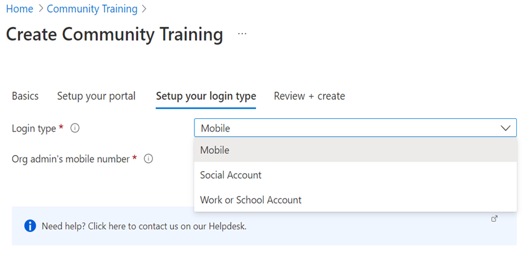
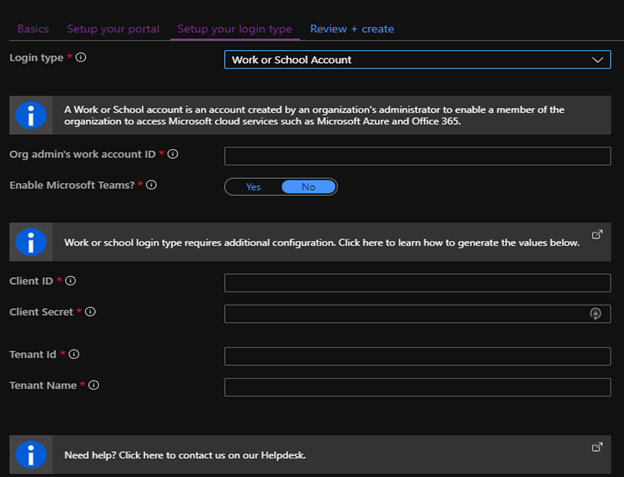

# Configure login identity for the platform

## Prerequisite

Please follow [**installation article**](../../infrastructure-management/install-your-platform-instance/installation-guide-detailed-steps.md) to Deploy your MCT instance. In the step “**Set up your Login type**”, select the suitable identity type.



and follow the below documentation to configure login identity.

## Configure login identity

Microsoft Community Training platform provides three types of login:

1. Phone number
2. Social email-based login via your Microsoft, Google or Facebook account
3. Microsoft Work or School account

> [!NOTE]
> Please note this article is in continuation of the [**installation article**](../../infrastructure-management/install-your-platform-instance/installation-guide-detailed-steps.md).

In this article, we will walk you through on how to configure login identity for the platform.

## Phone based authentication

There is no additional configuration needed for phone-based login.

## Work or School Account based authentication

### **Option 1** - Run AAD script to Configure Work or School account for your training portal by following the instructions below

#### Step 1 - Login to Azure portal

Use an existing subscription for login to portal

#### Step 2 - Create Azure AD application

**Pre-requisite:**
MCT requires Azure Active Directory application creation and registration. To successfully run the AAD creation script, the following permissions are needed:

1. Tenant - AAD app creator
2. Subscription - Owner

**Further Steps:**

1. Open Cloud Shell in azure portal

2. Run the following steps in a Cloud Shell instance using the PowerShell environment.
    1. Download the AAD app creation script using following command: `wget -q https://raw.githubusercontent.com/MicrosoftDocs/microsoft-community-training/live/microsoft-community-training/media/aad_app_creation.ps1 -O ./aad_app_creation.ps1`

    2. By default, the file is downloaded to your home directory. Navigate to the home directory with following command: **cd**

    3. Run the AAD script downloaded in step 1: **./aad_app_creation.ps1**

    The script asks for the following two inputs:

      * Training Portal’s Website Name:  Training portal’s website name. For example: If training portal URL is <https://contosolearning.azurefd.net/> , you need to enter “contosolearning”

      * Azure AD’s Tenant Domain Name: Azure AD’s tenant domain name. For example: contoso.onmicrosoft.com

The AAD script takes ~2 minutes to run and outputs 4 values on screen (Client ID, Client Secret, Tenant Id, Tenant name). Make a note of the output values as they will be needed in next step. If someone else ran the script, ask them to share this output.
A new app is created. If an app already exists with the same name, the script will delete the existing app and create a new app. In case of facing any issues after deployment please refer this [**guide**](troubleshooting.md#issue-7-azure-active-directory-configuration-issue).

### **Option 2** - Follow the Manual steps to Configure Work or School account for your training portal by following the instructions below

#### Step 1 - Setup your Azure AD

You can create a new Azure Active Directory tenant or use an existing one based on your organization requirement.

1. Create a new Azure Active Directory tenant and copy the tenant name required later as **Tenant Name**. If you already have an existing Azure AD, use the same and copy the tenant name required later as **Tenant Name**. For example, if the default domain for your Azure AD tenant is **contoso.onmicrosoft.com**, then enter **contoso**.
2. Go to the **Show diagnostics** section on the right and copy the tenant ID required later as **Tenant ID**.

#### Step 2 - Create an Azure AD application

1. Create a new Azure AD application by following [**this article**](https://docs.microsoft.com/azure/active-directory/develop/quickstart-register-app). You only need to follow the section titled **Register an application**. Please ensure to set the Redirect URIs as per below:

    **Redirect URIs**

    * Set to type "Web"
    * Add following to Redirect URIs:
        * **`https://name.azurefd.net/signin-azureAD`**,
        * **`https://name.azurewebsites.net/signin-azureAD`** and
        * **`https://name-staging.azurewebsites.net/signin-azureAD`** where **"name"** corresponds to your website name.
        :::image type="content" source="../../media/Redirect URIs.png" alt-text="Manual AAD Setup Step 1a":::

2. Click on Expose an API from the left menu of your application.


3. Click on "Add a scope". Ensure that the auto-populated value of Application ID URI is of the form "api://{ClientID}"


4. Click on Save and continue.
5. Enter the value "access_as_user" under Scope name.
6. Select Admins and users under Who can consent?
7. Populate the remaining values. These values appear on the login screen (unless global consent is granted by admin)
    
8. Obtain Client ID and Client Secret:

    * Copy the value of Application ID required later as Client ID
    * Click on Certificates & Secrets from the left menu.
    * Click on New client secret.
    
    * Enter the description and expiry time of the secret (recommended to select maximum allowed time for expiry) and click on Save button. A value would be shown. Save this Client secret value. Would be required later as the ClientSecret.
    :::image type="content" source="../../media/Obtain clientsecret value.PNG" alt-text="Image showing how to obtain Client Secret value ":::

9. Make a note of the values and follow [**installation article**](../../infrastructure-management/install-your-platform-instance/installation-guide-detailed-steps.md) to complete the Deployment by configuring obtained values as below.

    

> [!Note]
>If you are facing any issues while Deploying your AD instance, please follow the header "Azure Active Directory Configuration issue" under [**troubleshooting document**](troubleshooting.md) and send us the required output.

### Multi-Tenant support for Azure Active Directory based Authentication

MCT supports login via multiple tenants for AAD authentication. This can be done with few configurations while following steps during AAD set up ([**Configurations on the Training Platform**](../../settings/configurations-on-the-training-platform.md#steps-to-set-the-configurations-on-the-platform)). Follow this documentation to reach App configuration section from your [**Azure portal**](https://www.portal.azure.com/).

#### Steps to enable multi-tenant login for an AAD based instance

1. Login to your [**Azure portal**](https://www.portal.azure.com/)
2. Navigate to [**Configurations on the Training Platform**](../../settings/configurations-on-the-training-platform.md#steps-to-set-the-configurations-on-the-platform)
3. For adding multiple tenants:

    * For New Deployments:
        * If you are running AAD script while       [**Configuring login identity for the platform**](#work-or-school-account-based-authentication) to create new deployment then give the Tenant Id as ‘**common**’ at the time of deployment in place of original Tenant ID that you received after running the script.
        * If you are following manual steps while [**Configuring login identity for the platform**](#option-2---follow-the-manual-steps-to-configure-work-or-school-account-for-your-training-portal-by-following-the-instructions-below) to create new deployment then provide the Tenant ID as ‘common’ in the “Set up your login type” window instead of the Tenant ID from your Azure AD.

    * For Existing deployments:
        * In [**Configurations on the Training Platform**](../../settings/configurations-on-the-training-platform.md#steps-to-set-the-configurations-on-the-platform) , search for **idp:AzureADExternalAuthTenantId**. Set the value as ‘**common**’ replacing the existing tenant id (we suggest you keep a copy of your original Tenant ID value as a reference). Click ‘Ok’.

            :::image type="content" source="../../media/MultitenantAAD1.png" alt-text="multi tenant app setting":::

4. Now while in Configurations section, search for **idp:AzureADExternalAuthTenant** and note the Tenant name.
5. Search for **idp:AzureADExternalAuthClientId** and note Client ID.
6. Navigate to your tenant (tenant name from step 4) where your AAD exists, click on App registrations and search for application which corresponds to client id from step 5.

    :::image type="content" source="../../media/MultitenantAAD2.png" alt-text="multiple tenant app reg":::

7. Click on the application and navigate to ‘Authentication’ and select ‘Accounts in any organizational directory (Any Azure AD directory - Multitenant)’ under Supported account types and click ‘Save’

    :::image type="content" source="../../media/MultitenantAAD3.png" alt-text="multi tenant authentication":::

8. For first time login using multiple tenants, admin of those tenants needs to approve the client ID of the MCT application by using URL, in below url replace the placeholder with clientID from step 5.

    ```URL
    https://login.microsoftonline.com/common/adminconsent?client_id=<client_ID_of_your_application >

    ```

## Social account or email based authentication

You can configure social account for your training portal by following the instructions below:  

### Step 1 - Setup your Azure AD B2C

You can create a new Azure AD B2C tenant or create an existing one based on your organization requirement.

1. Login to [**Azure portal**](https://portal.azure.com/).

2. Create a new [**Azure Active Directory B2C**](/azure/active-directory-b2c/tutorial-create-tenant)  tenant.

3. Link the Azure Active Directory B2C tenant just created to your Azure subscription.  

### Step 2 - Create Azure AD B2C application

Here are the steps an create on Azure AD B2C tenant and link the same with your training portal instance:

1. Create a new Azure AD B2C application by following [**this article**](/azure/active-directory-b2c/tutorial-register-applications). Please ensure application properties are set as following:
    1. Web app / Web API - set to "Yes"
    2. Allow implicit flow - set to "No"
    3. Add following to **Reply URL**
        1. "https://*name*.azurefd.net/signin-b2c"
        2. "https://*name*.azurewebsites.net/signin-b2c"
        3. "https://*name*-staging.azurewebsites.net/signin-b2c"
    where "name" corresponds to your website name.

    4. If you are setting up **Password reset flow**, then add following to **Reply URL**
        1. "https://*name*.azurefd.net/signin-b2c-pwd"
        2. "https://*name*.azurewebsites.net/signin-b2c-pwd"
        3. "https://*name*-staging.azurewebsites.net/signin-b2c-pwd"  
    where "name" corresponds to your website name.
2. Copy the Application ID value to be required later for **Client ID**.
    :::image type="content" source="../../media/cliendIDB2C.png" alt-text="clientapplicaitonID":::
3. In your Application, under Manage, go to **Certificates & Secrets** and click on **Generate Key**.
4. Click on **Save** and the app key will appear. Copy the value to be required later for **Client Secret**.
    :::image type="content" source="../../media/cliendsecretB2C.png" alt-text="clientsecretforB2C":::
5. Go to Azure Active Directory from the left menu of your Azure portal, click on Domain Names and copy the tenant name under Name to be required later for **Tenant Name**. For example, if the default domain for your Azure AD tenant is **contoso.onmicrosoft.com**, then enter **contoso**.
6. Refer [**this article**](/azure/active-directory-b2c/tutorial-create-user-flows) article to create a **signing flow** (a sign-up and sign-in user flow) and a **password reset flow** (for local account)
    * Select Email Addresses, Given Name, Identity Provider and Surname in Application claims
    * Application claims should be same as following screenshot
    
    * Don’t select any Sign-up attributes
    
    * Copy the user-flow(s) name to be required later (These will be required during MCT platform installation)
    >
    > [!NOTE]
    > Setting Password Reset Flow for an Existing Deployment:
    > If you are setting up the **Password reset flow** on an existing deployment with Azure AD B2C authentication:
    >
    > 1. Set Userflow Name as **pwd_reset** (Step #1 in Create Flow using steps in [**this article**](/azure/active-directory-b2c/tutorial-create-user-flows)
    >
    > 2. Add the following URLs in the **Reply URL** section,
        >
        > * `https://*name*.azurefd.net/signin-b2c-pwd`
        > * `https://*name*.azurewebsites.net/signin-b2c-pwd`
        > * `https://*name*-staging.azurewebsites.net/signin-b2c-pwd` where "name" corresponds to your website name.
        >
    > 3. Open **App Service** and add the following configurations both with value as **B2C_1_pwd_reset**,
        >
        > * AzureADB2CPasswordResetPolicy
        > * idp:AzureADB2CPasswordResetPolicy
        >
        >

7. Follow the [**installation article**](../../infrastructure-management/install-your-platform-instance/installation-guide-detailed-steps.md) to complete the Deployment by configuring obtained values as per the below screenshot

    

### Step 3 - Configure your Identity provider

Here are the steps to create policies based on the Identity Provider:

1. **Configure the identity provider** – based on your chosen provider such as [**Microsoft**](/azure/active-directory-b2c/active-directory-b2c-setup-msa-app), [**Google**](/azure/active-directory-b2c/active-directory-b2c-setup-goog-app) and [**Facebook**](/azure/active-directory-b2c/active-directory-b2c-setup-fb-app)

2. **Configure you Local Account** - You can configure local account for your training portal by following the instructions below:

    1. Navigate to the Azure AD B2C tenant.
    2. Under Policies select User Flow and click on the required User Flow from the populated list.
    3. Under Settings, select Identity Providers and check whether the configuration matches exactly as below.

        

    4. In the same window, select Application Claims and check whether the configuration matches exactly as below.

        

    5. Select User Attributes and ensure no options are selected.
    6. Restart the training portal App service.
        

    7. Once the app successfully restarts, verify if user can login using local account.
