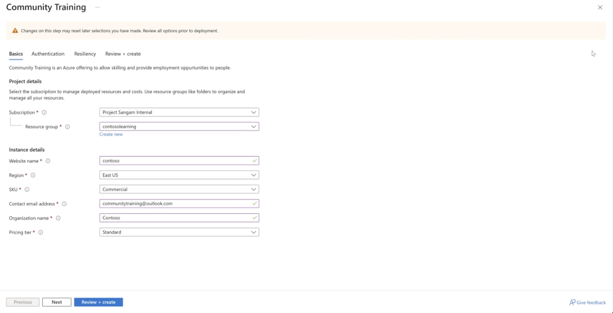
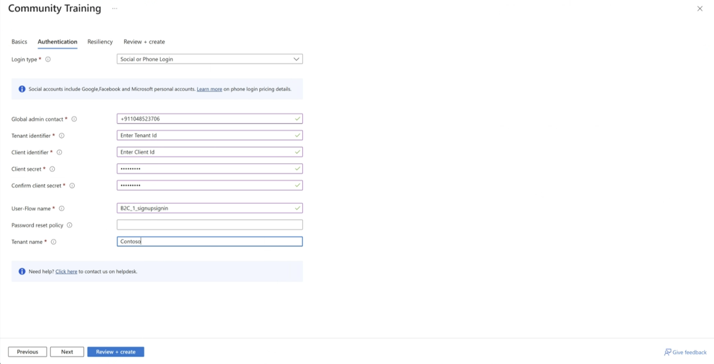
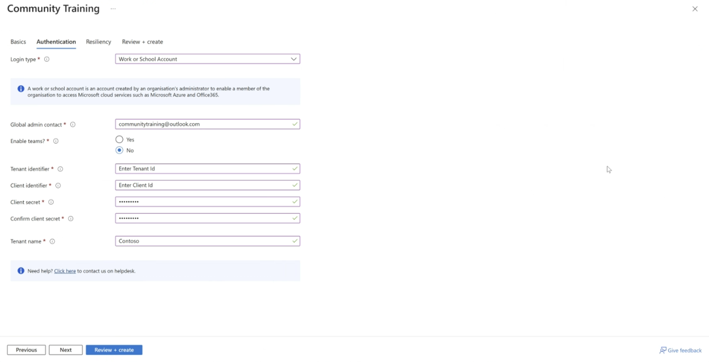
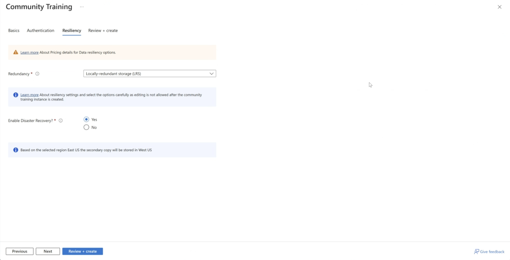

# Detailed step by step installation guide

In this article, you’ll learn how to install and deploy Microsoft Community Training platform on your Azure subscription.

## Before you begin

### 1. Create a pay-as-you-go Azure subscription

Create a pay-as-you-go Azure subscription. To learn more about how to create it, refer [**this article**](https://azure.microsoft.com/pricing/purchase-options/pay-as-you-go/) on Azure documentation.

If you have a free trial Azure subscription, please upgrade to a Pay-as-you-go Azure subscription. See the [**detailed steps here**](/azure/billing/billing-upgrade-azure-subscription#upgrade-your-azure-free-account). **We currently do not support Microsoft Community Training on free trial Azure subscriptions.**

> [!WARNING]
> If you’re a nonprofit organization who wants to use Microsoft Community Training platform, you can apply and avail the Azure grant subject to eligibility. See the [**detailed steps here**](../../infrastructure-management/install-your-platform-instance/setup-platform-instance-on-azure-subscription-for-nonprofits.md).

### 2. Get the right ownership access

Get the **owner** access to your pay-as-you-go Azure subscription. To learn more about how to get access, refer [**this article**](/azure/role-based-access-control/overview) on Azure documentation.

### 3. Create a Google Play Account

[**Sign up on Google Play console**](https://play.google.com/apps/publish/signup/)  in order to publish your app on the Google Play Store.  This is required only if you require mobile app for Microsoft Community Training instance.

> [!NOTE]
> This step may be done later after installation.

## Steps to deploy platform from Azure portal  

1. Ensure you are completed all the pre-requisites.

2. Login to [**Azure portal**](https://portal.azure.com/) using your credentials.

3. Under "All Services", locate **Community Training** under **Web & Mobile** and click on it.

    

4. Click on **Create Community Training** to start the deployment process.
    >NOTE: If you already have an instance of the Community Training and would like to create a second one, click on create to the top left of the screen.

    

    [!Note]
    >Over the next few screens, you will enter the information required to set the platform. 

5. On the Basic information page, select the subscription ID associated with your account. If you have a resource group, please select. OR, click on "Create New" to create a new resouce group. Also select the SKU and the pricing tier.

    

    > [!Note]
    >Community Training offers two SKUs with license fees in addition to an Azure infrastructure fee for cloud services consumers.
    >1. Non-profit
    >2. Commercial   
 For more information on the pricing, please visit the [**Pricing and Subscription**](../../frequently-asked-questions/pricing-subscription.md)

    [!Note]
    >Community Training Installations are offered in two pricing tiers.
    >1. Standard
    >2. Premium  
    >For more information on the pricing, please visit the [**Pricing and Subscription**](../../frequently-asked-questions/pricing-subscription.md)

    
    Once done, click on **Next**

6. Slect the type of **Authentication** you would like to have on your platform. The choices are between:
        
    i. Social or Phone Login  
    ii. Work or School Account

    **i. Social or Phone Login**  
    
    This option allows you to use a Google or Facebook based login to Community Training. For Phone based login, please refer to this [**link**](https://azure.microsoft.com/en-us/pricing/details/active-directory-external-identities/) for pricing and setup.

    > [!Note]  
    >You will need Azure Active Directory, also known as Azure Entra ID to be setup to choose either option. Please refer to the documentation [**here**](https://learn.microsoft.com/en-us/entra/external-id/).

    

    **ii. Work or School Account**  

    This option allows you to use existing work or school account lo login to the Community Training. You will need to provide a contact who will act as the Global Admin on the Community Training.  

    You also have the option to connect your MS Teams subscription to the Community Training instance.

    

Once you have made a choice of authenticated and entered corresponding information, click on **Next**

7. On this screen, you will select the data resiliency and disaster recovery options.

> [!Note]
> The Disaster Recovery options come at a cost. Please refer to the [**pricing Calculator**] (https://communitytraining.microsoft.com/pricing/)to get an estimate of the cost.

> [!Note]
> The decision to have a disaster recovery needs to be made at installation. This option can **NOT** be changed later. 

> [!NOTE]
>Service A stores customer data. By default, customer data stays within the region the customer deploys the service instance in. However, the customer can choose to replicate data to a paired region (If Available) for Disaster Recovery purposes. For list of available regions, please refer to this [***link***](https://learn.microsoft.com/en-us/azure/reliability/cross-region-replication-azure#azure-paired-regions).

Once you have made your selection, click on **Next** or **Review + Create**

8. On the next screen, verify the values entered are correct and click **Create**.

Congratulations, you have configured the installation of the Community Training on your instace. 

Once the deployment is complete and the website is up, refer to the [**getting started guide**](../../get-started/step-by-step-configuration-guide.md) to start configuring your learning portal.

Below are few additional resources to help you with the setup. 

* [**social account configuration guide**](../../infrastructure-management/install-your-platform-instance/configure-login-social-work-school-account.md#social-account-or-email-based-authentication) to enter the values requested.

* [**work or school account configuration guide**](../../infrastructure-management/install-your-platform-instance/configure-login-social-work-school-account.md#work-or-school-account-based-authentication) to enter the values requested.

To setup a mobile app for your instance, follow the instructions given in the [**create and publish your Mobile App**](../../infrastructure-management/install-your-platform-instance/create-publish-mobile-app.md) article.

To setup Teams for your instance , follow the instructions given in the [**setup Microsoft Teams as learner's endpoint**](../../infrastructure-management/install-your-platform-instance/create-teams-app-for-your-training-portal.md) for the platform article.
