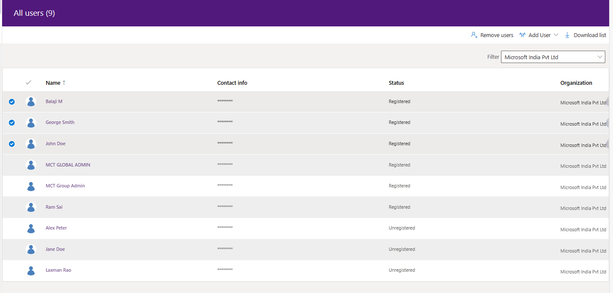

# Delete a user from the platform

In this topic, you will learn how to delete or remove an existing user from the platform.

## Permissions Level

The Community Training portal provides role-based permission levels. The table below shows which administrative roles can delete a user.

| Access Level    | Delete a user from the platform |
| --- | --- |
| Global Administrator | Yes |
| Organization Administrator | No |
| Learning Path Administrator | No |
| Category Administrator | No |
| Course Administrator | No |
| Group Administrator | No |

## Steps to delete a user from the platform

1. Log on to the Community Training portal and [**switch to administrator view**](../../get-started/step-by-step-configuration-guide.md#step-2--switch-to-administrator-view-of-the-portal).

1. Select **All Users** from the Users tab on the left.

1. Check the **radio button** to the left to select a user you want to delete from the platform.

1. Select **Remove users** on the top-right of the details page.

    

1. Select **Ok** to confirm deletion of the selected users from the platform.

    

> [!WARNING]
> When you remove a user from the platform, all the information around course enrollment, learner progress and group participation is also deleted from the portal. **User information cannot be recovered once deleted**.
